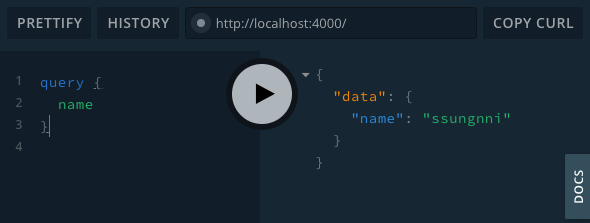

# MovieQL
- Movie API with Graphql (with Nomad Academy: [link](https://academy.nomadcoders.co/courses/enrolled/357405))
- 1) 직접 서버를 만들어서 API를 배포, 2) GraphQL 알아보기 위해 시작한 강의

### 1. Hello and Introduction
- [Graphql-yoga](https://github.com/prisma/graphql-yoga): GraphQL을 쉽게 시작할 수 있게 해줘요!
- yarn add graphql-yoga

### 2. Problems solved by GraphQL
- Over-fetching
  - 요청한 정보의 영역보다 많은 정보를 서버에서 받는 것을 over-fetching 이라고 함. (ex) /users/ GET 요청시 유저 이름만 필요하지만 프로필 이미지 등 유저의 모든 정보가 담긴 내용을 받는 경우. 이 경우 user에 대한 모든 정보가 담긴 Object를 받아옴)
  - GraphQL은 over-fetching 없이 코드를 짤 수 있고, 개발자가 어떤 정보를 원하는지에 대해 통제할 수 있음. 즉, 원하는 정보만 선별적으로 받아올 수 있음.
- Under-fetching
  - 하나를 완성하기 위해 많은 소스를 요청하는 것. (ex) 카톡 클론시 /feed/, /notifications/, /user/1/ 등 다양한 정보를 받아와야 할 경우 요청을 3번 해야 함)
  - 위 케이스를 해결하기 위해서는 세가지의 요청 정보가 담긴 URL이 필요한데, GraphQL의 경우 URL 체계가 존재하지 않음. one-end point만 존재. 보낸 query에 대응되는 결과값만을 받아올 수 있음

### 3. Creating a GraphQL Server & 4. first Query and Resolver
- yarn global add nodemon: nodemon은 소스 수정시 자동으로 서버를 재시작 해줌
- scheme: 사용자에게 보내거나, 사용자로부터 받을 data에 대한 설명. (description of data that you're gonna get and the data that you're gonna send)
- `schema.graphql`에 query를 정의하고, query에 어떤 데이터를 제공해 줄것인지 resolver를 통해 정의. `.graphql`에서의 `!`는 required를 의미(not null or not optional)
- index.js에서 scheme와 resolver를 넣어 GraphQLServer를 생성
- 

### 5. Extending the Schema
- schema의 query에 Person 타입을 넣을 경우, 쿼리 요청시 원하는 값만 불러올 수 있음. (ex. person-age만)
- REST와 달리 URL이 따로 없고 Play ground(graphql-yoga에서 제공)의 DOCS를 통해 데이터 타입이 뭔지 쉽게 알 수 있음

### 6. Extending the Schema & 7. Creating Queries with Arguments
- schema를 `people: [Person]!, person(id: Int!): Person`로 정의하고 resolvers를 대응시키기.
- query에서 argument인 id 값을 받아서 처리해보기.
- 데이터가 어떻게 보일것인지 operation(scheme)에서 정의하고, operation(질문)을 Resolve(해결)하는 함수를 만드는 게 핵심.

### 8. Defining Mutations
